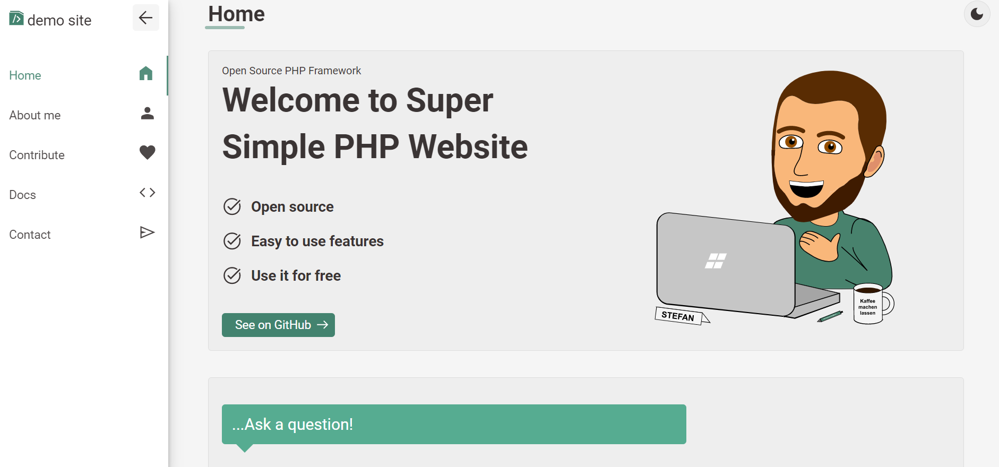
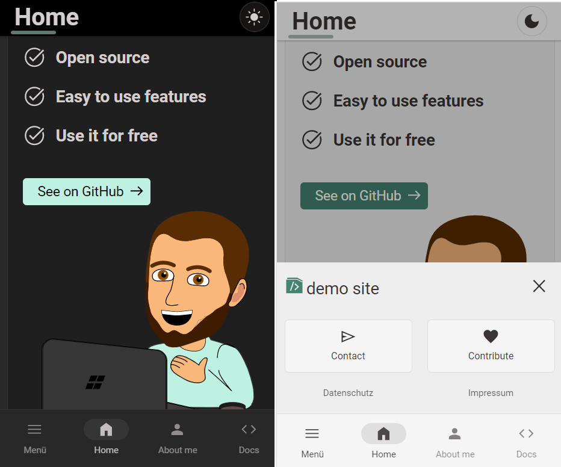

# Super Simple mini PHP framework

## Create a great looking website very fast
- check out https://coden-lassen.de which is based on this template
- This is a mini-mini-framework so the pagespeed should be awesome
- use the mini-framework functionality to do cool things very easy

## Check out the documentation:
- https://coden-lassen.de/github/super-simple-php-website/docu




## A few features:

### Design features:
- darkmode with great toogle and also possibility to add extra images for darkmode
- responsive website with sticky mobile bottom navigation
- icon support for icons you can host on your own server (no 3rd party request)
- self hosted website tracking system (optional)

### Create a new page:
- build pages with custom routes (pagepaths) with easy setip
- thats how you can create a new page:
1. Navigate to the pages folder and create a new php file e.g. "services.php"
2. Add the follwing code in pages/services.php:
```
<?php
/**
 * 
 * @route: path="/services" name="services"
 * @headline: Services
 * @seotitle: My Sample Page Title
 * @seodesc: This is my description to hope my seo ranking will be better
 * @seokeywords: a few keywords
 * 
 * navigation data:
 * @navname: Services
 * @navicon: code
 * @navdisplay: 3:main
 * @navmobile: :2main
 * 
 */
 ?>
 <h1>Your html</h2>
```
3. Thas it. Your site will be visible at your-domain.com/services

### Use custom content/blocks everywhere

1. check out the example in includes/blokcs/visit-github.php
2. create a new block in includes/blokcs/my-block.php
3. add content, e.g. <p>Hello, my name is Stefan</p>
4 display the block like this:
```  
<?php showBlock("my-block") ?>
```

### Send emails:
<?php
1. add your credentials in secrets/secrets.php
2. install phpmailer class via terminal
3. open the terminal and navigate to includes/libs
4. command: `cd includes/libs`
5. now install compaser packages
6. command: `composer install`
7. now you can use the sendMail function
```
$to = "stefan@coden-lassen.de";
$subject = "Test subject";
$reply_to = "";
$reply_to_name = "";
$message = "Test message";
sendMail($to, $subject, $message, $reply_to, $reply_to_name);
    
<?php showBlock("my-block") ?>
```

### Connect to databse:
<?php
1. add your credentials in secrets/secrets.php
2. you can now use the php function db_connect()
3. this will return an connection in a variable
4. you can now use it like this in a page:

```
$pdo = $this->db_connect();

$sql = "INSERT INTO tracking (datum, type, seite, referrer, session, event, para) 
        VALUES (:datum, :type, :seite, :referrer, :session, :event, :para)";

$stmt = $pdo->prepare($sql);

$data = [
    "datum" => $datum,
    "type" => $type,
    "seite" => $seite,
    "referrer" => $referrer,
    "session" => $session,
    "event" => $event,
    "para" => $para
];

$stmt->execute($data);
```